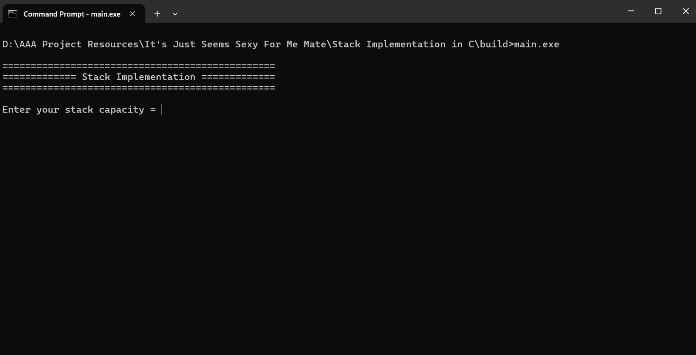
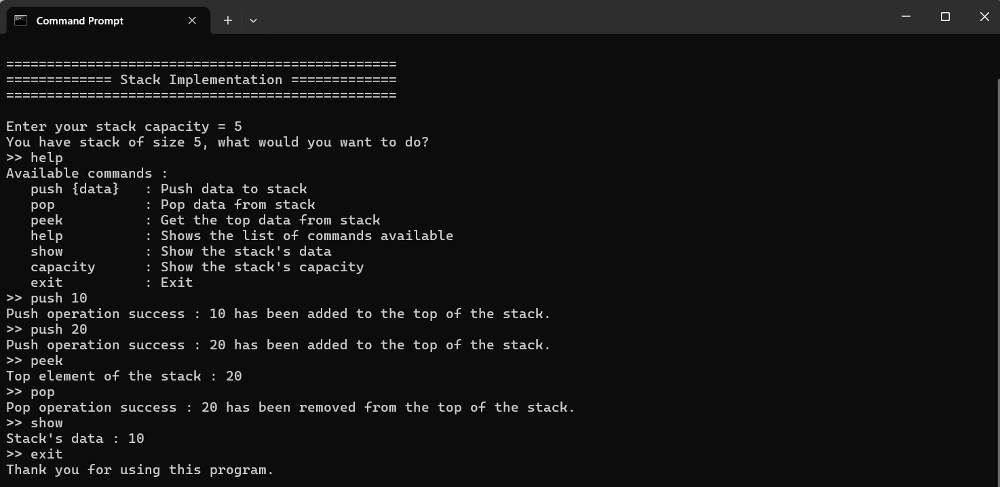

# Stack Impementation in C 

A simple stack implementation in C. This tool provides CLI features for system command.

## Features
- Implements a stack data structure using the C programming language.
- Supports core stack operations: push, pop, and peek.
- Handles stack overflow and underflow conditions safely.
- Uses a dynamically allocated array to store elements..
- Clear command-line interaction for testing stack operations.

## Requirements
To build the program from source on Windows, you must have these three tools installed:
- C Compiler (GCC via MinGW)
- CMake
- Clang-Format

## Installation
Clone the repository:

```bash
git clone https://github.com/Rasyid887/Stack-Implementation-in-C.git
cd Stack-Implementation-in-C
```

Build the project:
```bash
build
```

The script will automatically:
- configure the project using CMake,
- compile the source code,
- create the build/ directory (if it doesn't exist),
- and move into the build folder where the final executable is located.

## Usage
After the build script finishes, run the program:

```bash
main.exe
```

## Example





## Contributing

Contributions, suggestions, and improvements are welcome.
Feel free to open issues or submit pull requests.